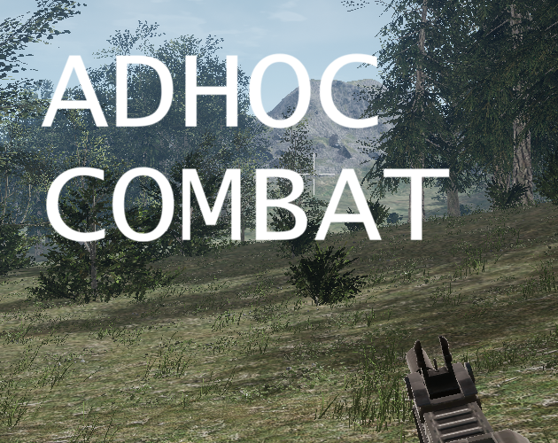

Available at https://adhoccombat.com

and https://speculativecoder.itch.io/adhoccombat

Screenshots: [1](Images/AdhocCombat.jpg) [2](Images/AdhocCombat1.jpg) [3](Images/AdhocCombat2.jpg) [4](Images/AdhocCombatMap.jpg)

This is a work in progress...

Got 5 minutes to spare, bored, in Windows or MacOS and have a Firefox, Safari or Chrome based browser? Time for some [_**AdhocCombat**!_](https://adhoccombat.com)

Be assigned to a random faction and fight AI controlled bots and sometimes other players! 

Pick from different weapons: Assault Rifle (all round weapon), Shotgun (better at close range), Light Machine Gun (bigger magazine), Marksman Rifle (long range), Grenade Launcher (AOE), or Rocket Launcher (slow firing but big AOE).

Fight for control of objectives on the map. You can only take objectives that are linked to an objective you already own (but if your faction has no objectives - you can take any objective).

Walk from area to area in the world and be automatically connected to the appropriate server.

Put down sandbags to use as cover.

AdhocCombat is in early development - hope to improve it and add more features! There will be occasional user/score wipes during development. The service may occasionally be down during maintenance/releases/fixes. I am using "spot" instances in AWS for cost purposes so sometimes the server(s) may be shut down. So, if the game is not working at the moment you could try again a few hours later.

Default controls:

- Left Mouse: Fire
- Right Mouse: Aim
- Middle Mouse: Third Person
- W: Forward
- A: Left
- D: Right
- S: Backward
- R: Reload
- Z or \ ​or Ctrl or ​Alt: Crouch or Prone
- 1: Primary Weapon
- 2: Pistol
- 3: Fabricator (puts down Sandbags)
- U: Change Loadout
- O: Settings Screen
- P: Change Team (for only this connection)
